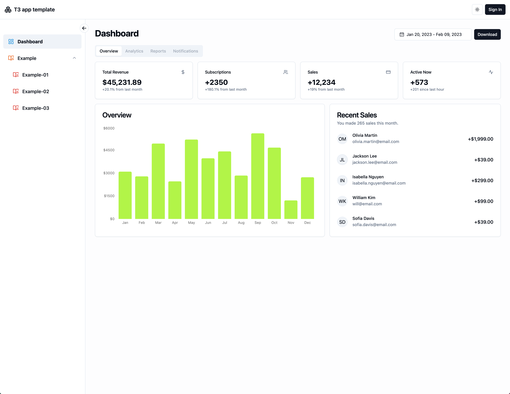
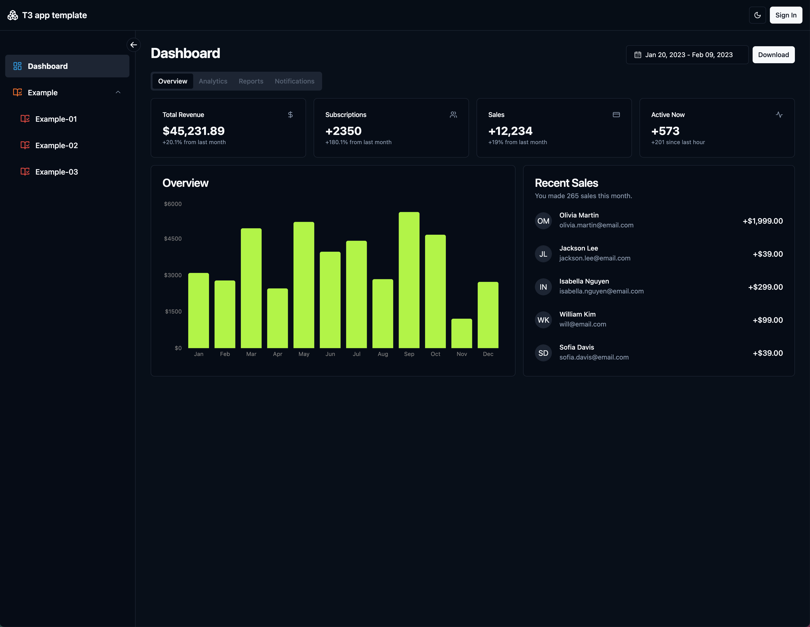
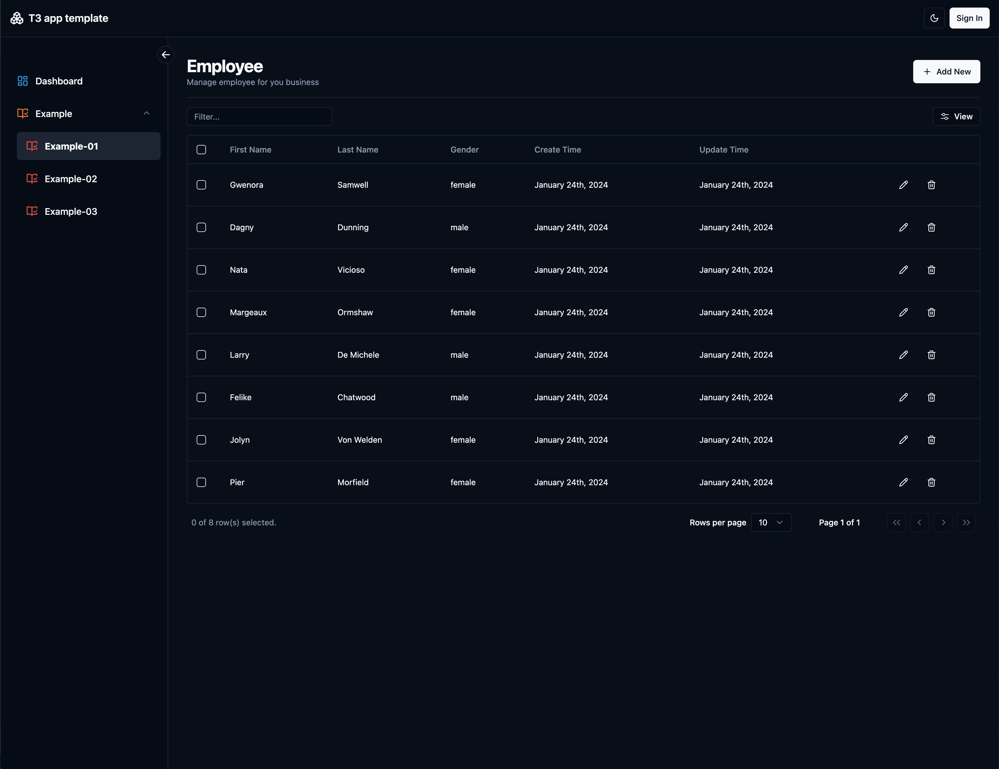

# [T3 App Template]: T3 Stack with shadcn-ui Admin Layout

## Overview

This project is a management interface developed using the [T3 Stack](https://create.t3.gg/), encapsulated with [shadcn-ui](https://ui.shadcn.com/)
. It aims to provide a responsive, user-friendly, and feature-rich admin interface suitable for various devices and screen sizes.

## Features

- Theme Switching: Allows users to switch the interface theme according to their preference or requirement.
- Responsive Sidebar: A flexible sidebar that adapts to different screen sizes and devices.
- Sidebar Shrinking: Users can expand or collapse the sidebar as needed to optimize screen space.
- Secondary Menu in Sidebar: For better organization and access, the sidebar includes multi-level menus.
- Mobile Sidebar: Specially designed for mobile devices to ensure smooth usage on smaller screens.
- Tanstack Table: Use tanstack table to implement curd operation
- NextAuth: Implemented Github login using NextAuth
- Global: Header, Loading and Modal
- Select: Implement multi-select input example
- Step Form: Implement step-form example
- Other Features...: Waiting for further updates

## Quick Start

1. Clone the repository: git clone https://github.com/gaofubin/t3-app-template.git
2. Install dependencies: npm install
3. Start the project: npm run dev

## Dashboard Demo

> Demo Link: https://t3-app-template.vercel.app/

